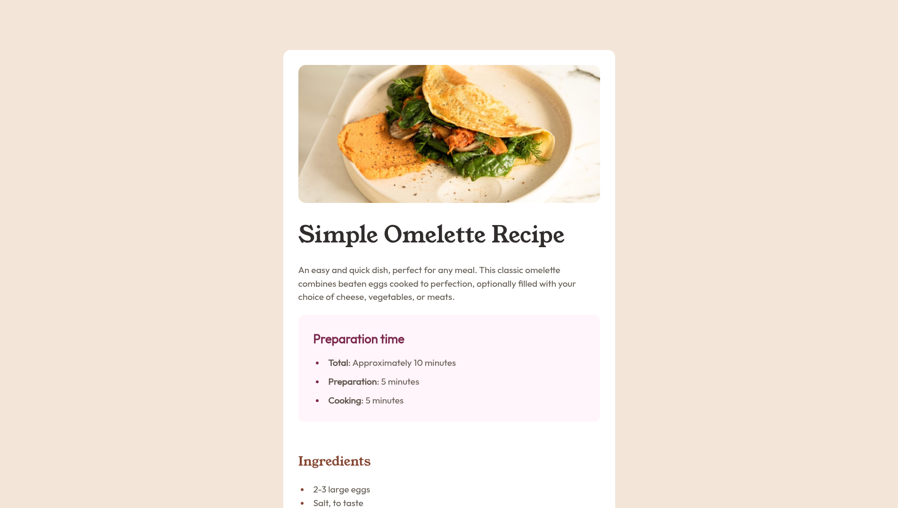

# Frontend Mentor - Social Links Profile Solution

This is a solution to the [Recipe page challenge on Frontend Mentor](https://www.frontendmentor.io/challenges/recipe-page-KiTsR8QQKm).

## Table of contents

- [Overview](#overview)
  - [Screenshot](#screenshot)
- [My process](#my-process)
  - [Built with](#built-with)
  - [Continued development](#continued-development)
  - [Useful resources](#useful-resources)
- [Author](#author)
- [Acknowledgments](#acknowledgments)

## Overview

### Screenshot

## My process

### Built with

- Semantic HTML5 markup
- CSS custom properties
- CSS Flexbox
- CSS Grid
- Mobile-first workflow
- CSS media queries

### Continued development

I want to improve my HTML and CSS skills by following best practices. That’s why I want to complete the Frontend Mentor learning path to deepen my frontend knowledge.

### Useful resources

- [Kevin Powell min, max, clamp video](https://www.youtube.com/watch?v=U9VF-4euyRo&t=47s) - This helped me understand logical functions

## Author

- Frontend Mentor - [@S4ZCO](https://www.frontendmentor.io/profile/S4ZCO)
- Twitter - [@s4zco_Dev](https://x.com/s4zco_Dev)
